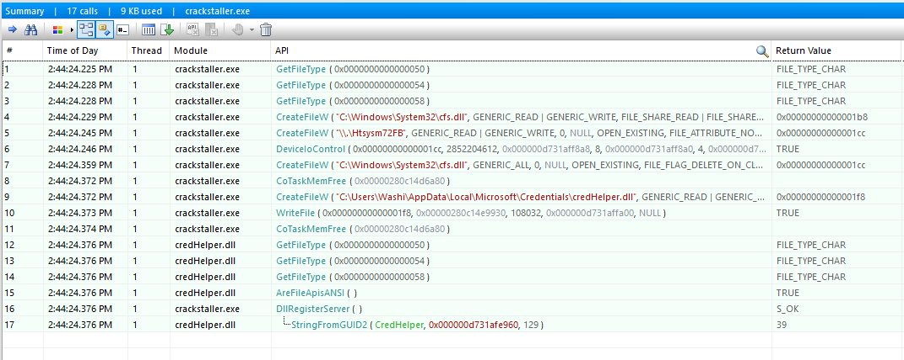
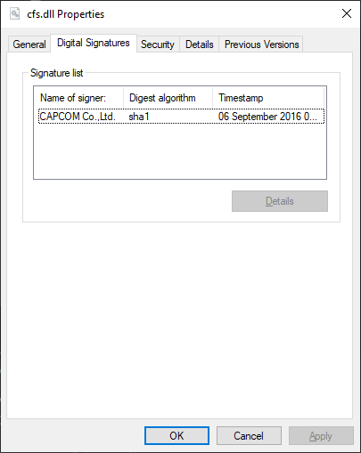
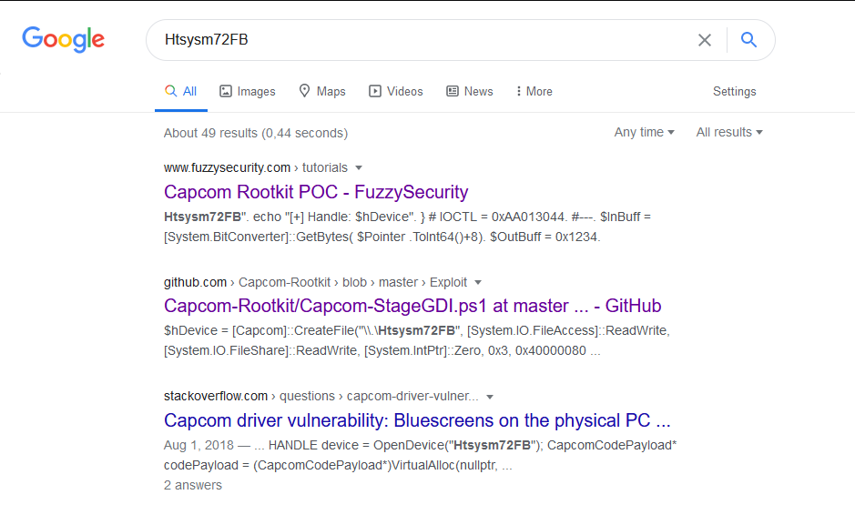
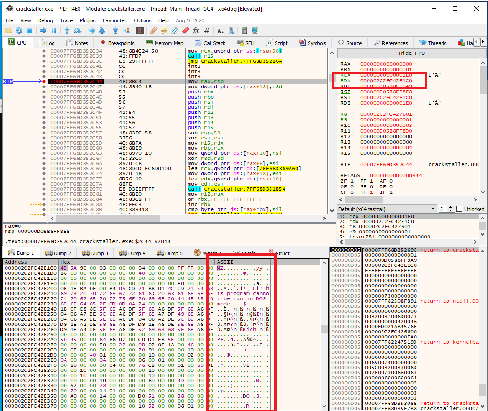
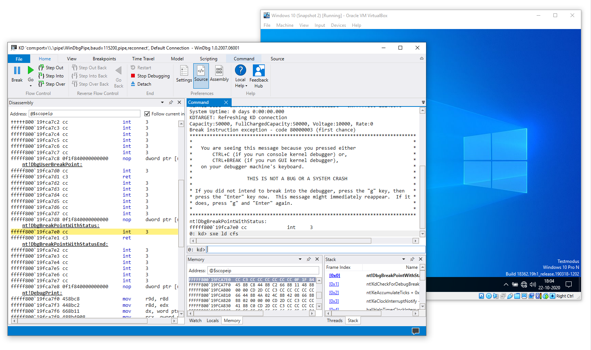
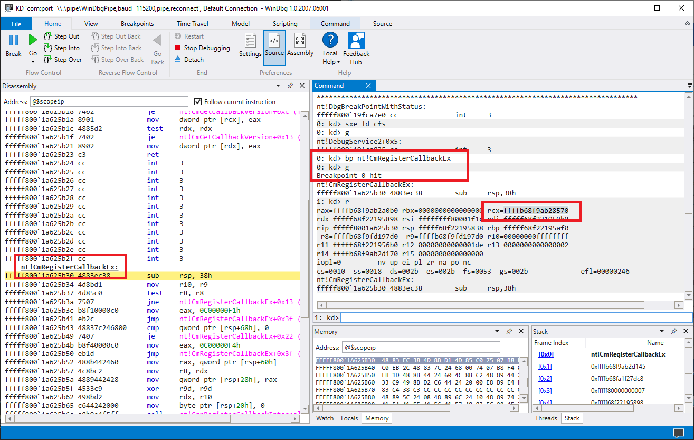
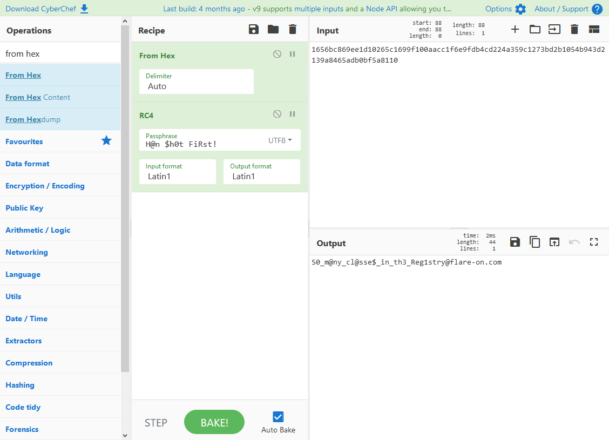

9 - crackstaller
==================

**Time spent:** about a day

**Tools used:** API monitor, x64dbg, Ghidra, WinDbg, CyberChef

Challenge 9 is a really interesting one, and is probably in the top 3 challenges for me personally. We are given a single executable called `crackstaller.exe`, together with a note that states: 

```
What kind of crackme doesn't even ask for the password? We need to work on our COMmunication skills.
```

Orientation
-----------

Running the executable indeed doesn't seem to do much as the note states. No dialog box, no command prompt, nothing. How are we supposed to do a challenge like this?

When I have no clue what is going on with an application, before diving deep into a disassembler, I like to use a tool like API monitor to get a rough feeling of what kind of procedures are called throughout a single execution of the program. This is typically useful for files that the app might be dropping. Furthermore, the note talks about `COMmunications`, which is probably a reference to COM. Therefore, in the filter options, I selected the following options:


And this is what we get:



Immediately we can see some interesting things.

- The app drops a file called `cfs.dll` in our system folder.
- The app opens a device called `\\.\Htsysm72FB`, and calls `DeviceIoControl` on it with some magic argument values.
- `cfs.dll` is then deleted afterwards.
- Then another file called `credHelper.dll` is dropped in AppData, which seems to be registered as a COM service using `DllRegisterService`.

Getting a hold of these files is easy; just set a breakpoint on `CreateFileW` using any debugger like x64dbg to stop execution before  `cfs.dll` is removed from the disk again. `credHelper.dll` is never removed, so we can just grab it directly from our AppData folder. A copy of the files can be found [here](cfs.dll) and [here](credHelper.dll).


Analysing credHelper.dll
------------------------

If we open `credHelper.dll` in Ghidra, and look up the `DllRegisterService` export, we can see all it does is adding some keys to the registry:


```csharp
ulonglong DllRegisterServer(void)
{
    /* ... */
    uVar2 = RegCreateKeyExW(0xffffffff80000000,&"CLSID\\",0,0x0,0,0xf003f,0x0,&key,0x0);
    uVar6 = uVar2;
    if (uVar2 == 0) {
        uVar2 = RegSetValueExW(key,0x0,0,1,&"CredHelper",0x16);
        uVar6 = uVar2;
        if (uVar2 == 0) {
            uVar2 = RegCreateKeyExW(key,L"InProcServer32",0,0x0,0,0xf003f,0x0,&local_res18,0x0);
            uVar6 = uVar2;
            if (uVar2 == 0) {
                uVar2 = RegCreateKeyExW(key,L"Config",0,0x0,0,0xf003f,0x0,&local_res20,0x0);
                uVar6 = uVar2;
                if (uVar2 == 0) {
                    uVar2 = RegSetValueExW(local_res18,0x0,0,1,local_228,lVar3 * 2 + 2);
                    uVar6 = uVar2;
                    if (uVar2 == 0) {
                        uVar2 = RegSetValueExW(local_res18,L"ThreadingModel",0,1,&local_550,0x14);
                        uVar6 = uVar2;
                        if (uVar2 == 0) {
                            RegSetValueExW(local_res20,L"Password",0,1,local_res8,2);
                            RegSetValueExW(local_res20,L"Flag",0,1,local_res8,2);
                            return 0;
                        }
                    }
                }
            }
        }
    }
    /* ... */
}
```

This is pretty typical for a COM library. To register a COM library as a service, you'd add a sub key in the `HKEY_CLASSES_ROOT\CLSID\` key, containing a reference to the dll that implements the service, as well as a couple of configuration parameters. In our case, these parameters are called `Password` and `Flag`. Let's see where in the dll these registry values are used. Lucky for us, `credHelper.dll` doesn't seem to hide where they are accessed. They are visible as plain text in the strings view:


Cross referencing on the `Password` string, gives us the following:

```c
ulonglong FUN_18000153C(undefined8 this,DECRYPT_FLAG_INPUT *outputBuffer)
{
    /* ... */
    StringFromGUID2(&THE_CLSID,local_848,0x81);
    wsprintfW(subkey,L"%s\\%s\\%s");
    /* ... */

    // Read Password value.
    LVar1 = RegGetValueW(0xffffffff80000000,subkey,L"Password",2,0x0,passwordData,passwordLength);
    if ((((LVar1 == 0) && (2 < passwordLength[0])) &&
        (length = wchar_to_char(rc4_key,passwordData,0x104), length != 0x104)) && (length != -1)) {
        pData = outputBuffer->data;
        *outputBuffer = 0;
        
        // Initialize RC4 buffer.
        length_ = 0x100;
        j = _000;
        ptr = pData;
        do {
            *ptr = j;
            ii = j + 1;
            j = ii;
            ptr = ptr + 1;
        } while (ii < 0x100);
        iii = _000;
        pData2 = pData;
        j = _000;
        do {
            S[i] = *pData2;
            iii+1 = iii + 1;
            j = rc4_key[iii] + S[i] + j;
            *pData2 = pData[j];
            pData2 = pData2 + 1;
            pData[j] = S[i];
            iii = _000;
            if (iii+1 < length) {
                iii = iii+1;
            }
            length_ = length_ + -1;
        } while (length_ != 0);
    }
    /* ... */
}
```

A trained eye sees that this is nothing more than reading whatever is stored in the `Password` configuration value, and uses that to initialize an RC4 buffer. Similarly, if we cross reference on the `Flag` string, we see that it performs the actual RC4 decryption routine on a hardcoded buffer, and puts the result into the "Flag" value:

```c
ulonglong FUN_1800016D8(undefined8 param_1,DECRYPT_FLAG_INPUT *buffer)
{
    /* ... */

    // Decrypt using RC4
    i = buffer->initial_i;
    ppp = 0;
    j = buffer->initial_j;
    do {
        i = i + 1;
        data[j] = buffer->data[i];
        j = j + data[j];
        data[i] = buffer->data[j];
        buffer->data[i] = data[i];
        buffer->data[j] = data[j];
        inputBuffer[ppp] = buffer->data[data[i] + data[j]] ^ ENCRYPTED_FLAG[ppp];
        ppp = ppp + 1;
    } while (ppp < 0x2c);
    buffer->initial_i = i;
    buffer->initial_j = j;
    count = mbstowcs(flagBuffer,inputBuffer,0x2d);

    // Update Flag value.
    if ((count != -1) && (count != 0x2d)) {
        StringFromGUID2(&THE_CLSID,local_318,0x81);
        wsprintfW(local_208,L"%s\\%s\\%s",L"CLSID",local_318,L"Config");
        LVar1 = RegOpenKeyExW(0xffffffff80000000,local_208,0,0x20006,&local_res10);
        if (LVar1 == 0) {
            RegSetValueExW(local_res10,L"Flag",0,1,flagBuffer,count * 2);
            uVar2 = 0;
        }
    }
    return uVar2;
}
```

The encrypted flag data is:
```
1656bc869ee1d10265c1699f100aacc1f6e9fdb4cd224a359c1273bd2b1054b943d2139a8465adb0bf5a8110
```

Therefore, the only thing we need is figure out what the right password is to use as a decryption key for this RC4 encrypted buffer.


Analysing cfs.dll
-----------------

Let's have a look at the `cfs.dll` that gets dropped in our system folder. Opening it up in Ghidra shows not too much code actually. Let's look at the entrypoint:

```c
ulonglong entry(longlong param_1)
{
    /* ... */
    
    FUN_000103ac(&DAT_00010880,&Htsysm72FB);
    RtlInitUnicodeString(local_38,puVar6);
    uVar4 = IoCreateDevice(param_1,0,local_38,0xaa01,0,0,local_res18);
    if (-1 < uVar4) {
        lVar5 = 0;
        puVar6 = &DAT_00010840;
        do {
            sVar2 = *(L"\\DosDevices\\" + lVar5);
            *(&DAT_00010840 + lVar5) = sVar2;
            lVar5 = lVar5 + 2;
        } while (sVar2 != 0);
        FUN_000103ac(&DAT_00010840,&Htsysm72FB);
        RtlInitUnicodeString(local_28,puVar6);
        uVar3 = IoCreateSymbolicLink(local_28,local_38);
        uVar4 = uVar3;
        if (uVar3 < 0) {
            IoDeleteDevice(local_res18[0]);
        }
        else {
            *(param_1 + 0x80) = 0x104e4;
            *(param_1 + 0x70) = 0x104e4;
            *(param_1 + 0xe0) = 0x10590;
            *(param_1 + 0x68) = 0x1047c;
        }
    }
    return uVar4;
}
```

Since we know that this dll is a driver, we know that the first parameter of the entrypoint is of type `DRIVER_OBJECT`. Here is something that Ghidra could improve on. By default, Ghidra does not have type definitions / headers for driver objects. Therefore, it is a bit hard to see immediately what each pointer access is. However, spending a ltitle bit of time [looking at the definition of DRIVER_OBJECT](https://docs.microsoft.com/en-us/windows-hardware/drivers/ddi/wdm/ns-wdm-_driver_object), we can quickly see that the last 4 pointer writes register some callback functions. In our story, the third one is the important one (`0x10590`), since it is called upon every `DeviceIoControl` call to this driver. Let's have a look:

```c
ulonglong FUN_00010590(undefined8 param_1,longlong param_2)
{     
    /* ... */
    puVar2 = *(param_2 + 0x18);
    /* ... */
    if (code == 0xaa012044) {
        fnptr = *puVar2;
LAB_0001060e:
        uVar3 = FUN_00010524(fnptr);
        uVar4 = uVar3;
    }
              
    /* ... */
        if (code == 0xaa013044) {
            fnptr = *puVar2;
            goto LAB_0001060e;
        }

    /* ... */
    IofCompleteRequest(param_2,0);
    return *(param_2 + 0x30);
}
```

We can see the device IO control code is compared to `0xaa013044` (`2852204612` in decimal), which matches the value we saw in API monitor. When this IO code is triggered, it calls `FUN_00010524` with an argument that was fed into `DeviceIoControl`. Let's follow the trail:

```c
ulonglong FUN_00010524(undefined *fnptr)
{
    /* ... */
    
    puVar1 = *(fnptr + -8);
    if (puVar1 == fnptr) {
        local_18 = MmGetSystemRoutineAddress_exref;
        local_28 = 0;
        local_20 = fnptr;
        FUN_00010788(&local_28);

        // ???
        (*local_20)(local_18);

        FUN_000107a0(&local_28);
    }
    return puVar1 == fnptr;
}
```

Hold up, this interprets the input value as a function pointer, and then calls it? A driver that allows arbitrary code execution in kernel mode?! I mean even the cfs.dll file is digitally signed:



Surely something like this should never have been signed. I must have misinterpreted something. 

Rootkit as a service, brought to you by Capcom
-----------------------------------------------

Turns out, it is actually correct. A quick Google search for Capcom vulnerable driver and the weird `Htsysm72FB` string, confirms exactly our suspicion:



What in the world... 

Some further research brings us to [this](https://www.youtube.com/watch?v=pJZjWXxUEl4) very good YouTube video by OJ Reeves. In the video, he explains in great detail how it works, and how to exploit it. It also talks a great deal about how to debug kernel drivers using WinDbg, which we will be doing shortly as well. Be sure to give it a watch if you haven't already!

Finding the hidden driver
-------------------------

We now know that the `DeviceIoControl` passes on some code that is executed in kernel space. Let's figure out where this function is called in our original `crackstaller.exe`. A quick cross reference gives us the following:

```c
ulonglong TriggerIOCTL(HANDLE device,longlong address_of_pe)
{
    /* ... */
    nt_headers = *(address_of_pe + 0x3c) + address_of_pe;
    lVar12 = address_of_pe;

    // Find address of "DriverBootstrap" export
    lVar8 = FUN_140002e84((nt_headers->OptionalHeader).DataDirectory[0].VirtualAddress,nt_headers,address_of_pe);
    puVar9 = FUN_140002e84(*(lVar8 + 0x20),nt_headers,lVar12);
    local_res20 = FUN_140002e84(*puVar9,nt_headers,lVar12);
    if (*(lVar8 + 0x18) != 0) {
        do {
            uVar10 = strcmp(local_res20 + uVar15,"driverBootstrap",driverBootstrapLength);
            if (uVar10 == 0) {
                /* ... set final_param2 to address ... */
            }
            uVar14 = uVar15 + 1;
            uVar15 = uVar14;
        } while (uVar14 < *(lVar8 + 0x18));
    }
    /* ... */
LAB_140002d68:
    if (final_param2 != 0) {
        /* ... */

        // Allocate executable buffer to run 
        buffer = VirtualAlloc(0x0,0x2d,0x3000,0x40);
        if (buffer != 0x0) {
            
            /* ... Prepare shellcode ... */

            // Trigger capcom backdoor.
            BVar7 = DeviceIoControl(device,0xaa013044,&code_buffer_ptr,8,receive_buffer,4,received_bytes,0x0);

            /* ... */
        }
    }
LAB_140002e2a:
    if (device != 0xffffffffffffffff) {
        CloseHandle(device);
    }
    if ((uVar13 == 0) && (code_buffer_ptr != 0x0)) {
        VirtualFree(code_buffer_ptr,0,0x8000);
    }
    return uVar13;
}
```

From the code, we can see that it interprets the first parameter as a PE file, traverses the exports directory, looks for the "DriverBootstrap" function, takes the address of it and puts that as the entrypoint for the shell code to be executed by the backdoor capcom driver. 

We can easily get a hold of this hidden driver by simply launching a debugger, setting a breakpoint at this function, and looking at the second parameter of this function (which is stored in the RDX register). 



A copy of the embedded file can be found [here](driver.sys).

Analysing driver.sys
--------------------

Since the driver.sys is not loaded normally, the file is not mapped correctly in memory, nor are imports resolved. Having a quick look at `DriverBootstrap`, we can notice that it is simply resolving this issue by manually mapping the file into memory, and then calling the original entrypoint of the driver. It does that by allocating heaps with the name `"FLAR"`. That's generally a good sign we are on the right track!

The original entrypoint calls the real main function `FUN_140009000`. Let's have a look:

```c
ulonglong FUN_140009000(longlong driverObject)
{
    /* ... */
    
    if (-1 < local_138) {
        puVar1 = *(local_128 + 0x40);
        FUN_140004510(puVar1 + 2);
        KeInitializeEvent(puVar1 + 0x10,0,0);
        *puVar1 = 0;
        *(puVar1 + 0x16) = 0;
        local_138 = CmRegisterCallbackEx(FUN_140004570,&"360000",driverObject,driverObject,&ID_CALLBACK_ROUTINE,0);
    }
    if ((local_138 < 0) && (local_128 != 0)) {
        IoDeleteDevice(local_128);
    }
    return local_138;
}
```

We can see a call to `CmRegisterCallbackEx`. This is where we start to see code that is related to the registry. This is interesting, because the `credHelper.dll` reads the password from- and stores the flag into the registry! A quick [search on msdn](https://docs.microsoft.com/en-us/windows-hardware/drivers/ddi/wdm/nf-wdm-cmregistercallbackex) tells us that `CmRegisterCallBackEx` is used to register a function that is called whenever any program running on the system interacts with the registry. The function that is registered in our case is `FUN_140004570`:

```c
ulonglong FUN_140004570(longlong driverObject,longlong notifyClass,REG_CREATE_KEY_INFORMATION_V1 *eventDetails)
{
    /* ... */   

    // Check if current event is a write event.
    if ((((notifyClass != 0) && (eventDetails != 0x0)) && (driverObject != 0)) &&
       (local_res10 = notifyClass, local_res10 == 0x1a)) {
           /* ... lots of code, including crypto ... */

            // Check if our registry path is accessed.
            x = wcsstr(local_398,"{CEEACC6E-CCB2-4C4F-BCF6-D2176037A9A7}\\Config\\");
            if (x!= 0x0) {

                    /* ... more code, including crypto ... */

                    // Update key.
                    ZwCreateKey(&regKey,0xf003f,&local_320,0,&outputString,uVar9 << 0x20,eventDetails->Disposition);
                    ObReferenceObjectByHandle(regKey,eventDetails->DesiredAccess,eventDetails->ObjectType,0,&body,0);
                    ZwClose(regKey);
                    eventDetails->GrantedAccess = eventDetails->DesiredAccess;
                    eventDetails->ResultObject = body;
                    local_3b8 = 0xc0000503;
                    ExAcquireFastMutex(local_3c0 + 2);
                    *local_3c0 = *local_3c0 + 1;

                    if (*local_3c0 == 1) {
                        // Run thread that unloads the driver.
                        *(local_3c0 + 0x16) = 1;
                        local_3b8 = PsCreateSystemThread
                                              (&local_338,0x10000000,&local_2f0,0,0,*(driverObject + 0x68),driverObject)
                        ;
                        if (-1 < local_3b8) {
                            ZwClose(local_338);
                        }
                    }
                    ExReleaseFastMutex(local_3c0 + 2);
                }
            }
        }
        else {
            ExReleaseFastMutex(local_3c0 + 2);
        }
    }
    /* ... */
}
```

This function contains a lot of code. Way too much to analyse by hand. What is important to note though is the call to `ZwCreateKey`, that seems to update the contents of one of the values in our registry key. Instead of working out exactly what each and every crypto function does, let's do some dynamic analysis and let the program just do it for us.

Getting the password with WinDbg
--------------------------------

There is a lot of tutorials on how to set up WinDbg for kernel debugging. Personally, I used [this tutorial](https://www.virtualbox.org/wiki/Windows_Kernel_Debugging), since I worked with VirtualBox, however the same principles apply for other virtual machine software. You set up a COM serial port in your VM settings, and let WinDbg connect to it.

I used the new WinDbg Preview instead of classic WinDbg. WinDbg Preview can be downloaded from the Microsoft Stor for free, and no, you don't need a Microsoft Account to download it. Just click "Cancel" when it asks you to log in after clicking "Install".

After rebooting the virtual machine with debugging enabled and connecting WinDbg to our virtual box instance, we want to break at the moment our `cfs.dll` driver is loaded:

```
sxe ld cfs.dll
```



Starting `crackstaller.exe` triggers our breakpoint. We want to get to the RegistryCallback, so let's put a breakpoint on `CmRegisterCallbackEx`:

```
bp nt!CmRegisterCallbackEx
```

Continue execution brings us to the following:



In the RCX register, we find the address of our callback function. Let's put a breakpoint on the `ZwCreateKey` call that is made in this function. The offset ends with `add`. In my case, the call was at `ffffb68f9ab28add`:

```
bp ffffb68f`9ab28add
```

Continuing execution, we see something interesting in the arguments of this call:


Which is our password!

Getting the flag
----------------

We have everything we need to know to get to our flag. Since we already analysed the code of `credHelper.dll` and we already know it is simply just RC4, we can just throw everything into CyberChef...



... revealing the flag.